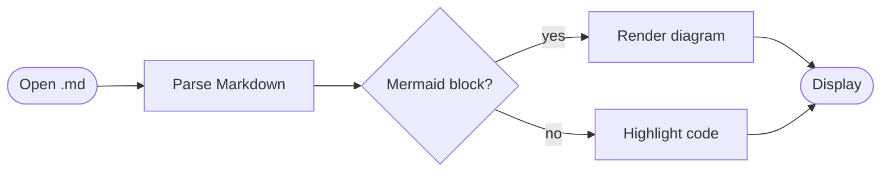
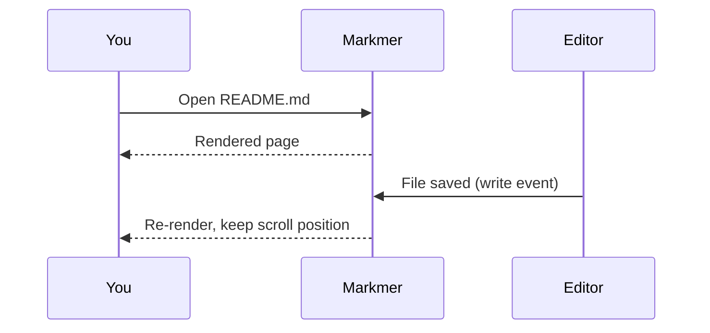
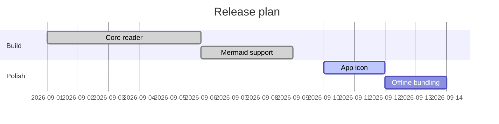

# Welcome to Markmer

Markmer is a small, fast Markdown reader for macOS with first-class **Mermaid** support.
Open a file with <kbd>⌘O</kbd>, drop one on the window, or pick it from the sidebar.

## What you get

- GitHub-flavoured Markdown: tables, task lists, strikethrough, autolinks
- Mermaid diagrams rendered inline, themed for light and dark mode
- Syntax highlighting for fenced code blocks
- Live reload: edit the file in your editor and Markmer re-renders in place
- A sidebar of recently opened files, searchable and persistent

## Mermaid







## Code

```swift
struct RecentFile: Identifiable, Codable {
    var path: String
    var lastOpened: Date
    var id: String { path }
}
```

```bash
# Bundle the JS libraries so the app works offline
./Tools/vendor.sh
```

## Tables and tasks

| Feature            | Status |
| ------------------ | :----: |
| Markdown rendering |   ✅   |
| Mermaid diagrams   |   ✅   |
| Recent files       |   ✅   |
| Live reload        |   ✅   |

- [x] Build the reader
- [x] Draw a logo
- [ ] Ship it

> Tip: links to other `.md` files open inside Markmer. External links open in your browser.
